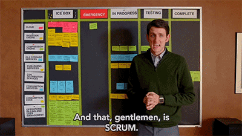
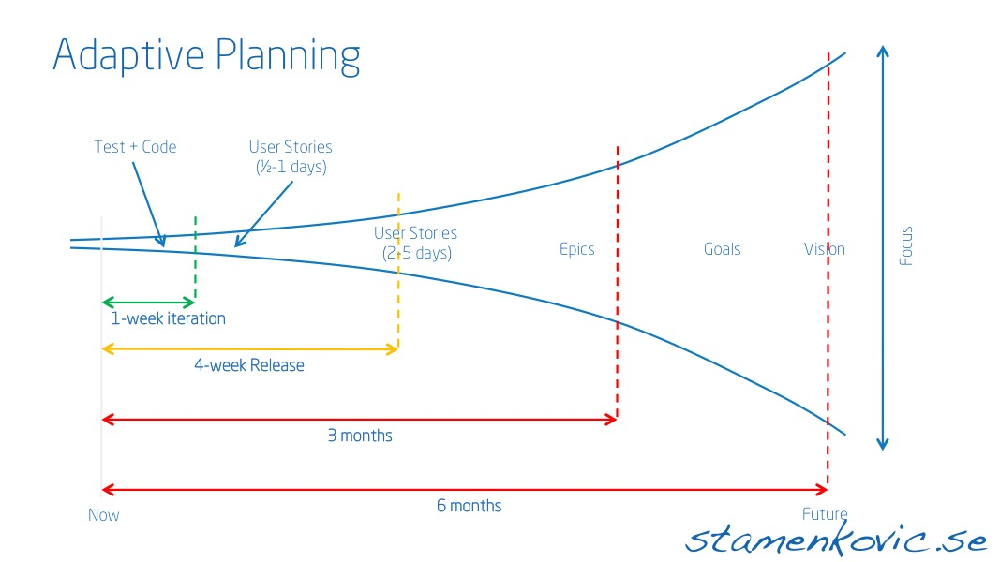

## Adopting Software Design Practices for Better Machine Learning
 
_Michael Simpson_

---

---

### Design:
#### Understanding the problem and finding a solution

----

#### Case Study: 
##### Communication Network Analysis

----

----

----

----

#### Understanding the Problem

----

##### Timeboxes

---

### Lean

----

#### Case Study:
#####  Facial Recogntion for User Authentication

----

----

----

----

----

#### Lean Canvas

----

#### Skateboard, Scooter, Car

----

#### Explore vs. Exploit

---

### Agile

##### Agile Manifesto
* Individuals and interactions over processes and tools
* Working software over comprehensive documentation
* Customer collaboration over contract negotiation
* Responding to change over following a plan

----

#### Case Study:
##### Document Annotation

----

----

----

#### Adaptive Planning

----

#### Stakeholders

----

#### Sprints

* Retrospectives
* Iteration Planning Meetings

----

#### Epics

----

#### Features
* Hypotheses
* Story Points

----

#### Acceptance Criteria

---

#### Research Spikes

----

#### Slack time

---

### Data Sciencing Software

----

#### Case Study:
##### Data Driven Feature Development

----

#### Modeling Users for Better Stories

----

#### A/B Testing

---

## Thank You
