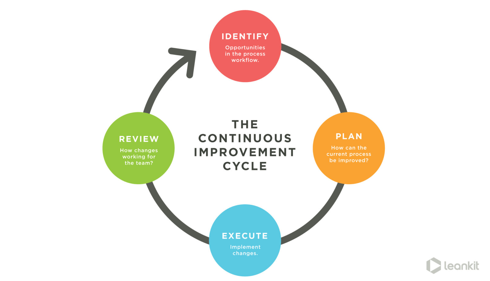

# Engineering Data Science
Michael Simpson

---

---

## Design

----

### Case Study: Communication Network Analysis

----

### Understanding the Problem

----

#### Timeboxes

---

## Lean

----

### Case Study: Facial Recogntion for User Authentication

----

### Lean Canvas

----

### Skateboard, Scooter, Car

----

### Explore vs. Exploit

---

## Agile

#### Agile Manifesto
* Individuals and interactions over processes and tools
* Working software over comprehensive documentation
* Customer collaboration over contract negotiation
* Responding to change over following a plan

----

### Case Study: Document Annotation

----

### Adaptive Planning

----

### Stakeholders

----

### Sprints

* Retrospectives
* Iteration Planning Meetings

----

### Epics

----

### Features
* Hypotheses
* Story Points

----

### Acceptance Criteria

---

## Data Sciencing Software

----

### Case Study: Data Driven Feature Development

----

### Modeling Users for Better Stories

----

### A/B Testing

---

# Thank You
